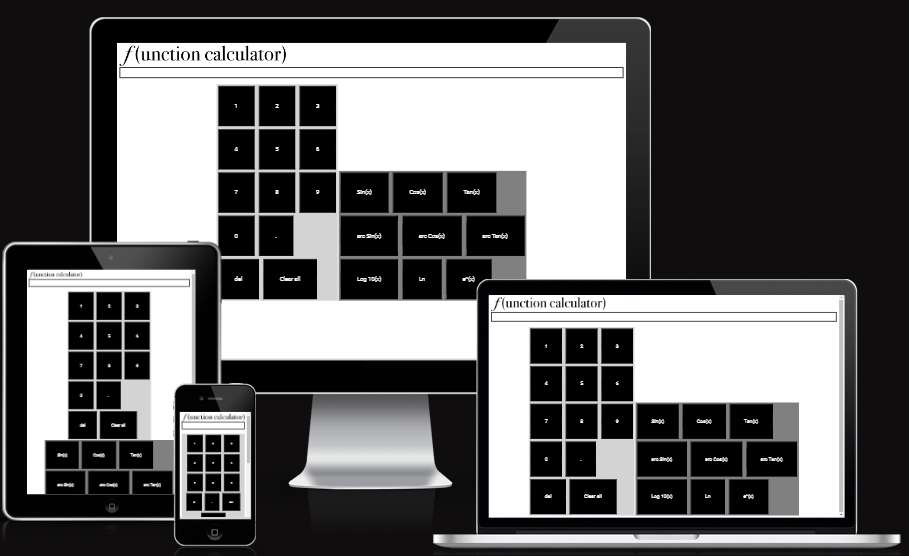
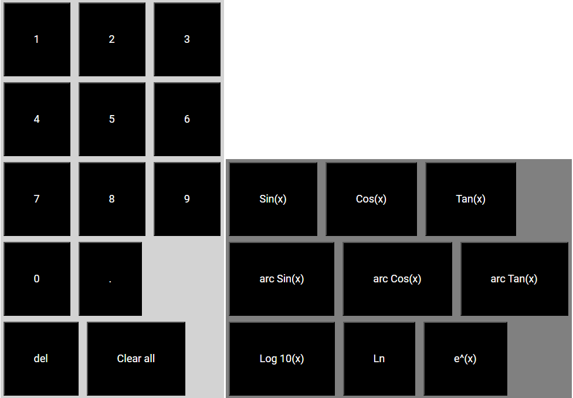

# Function Calculator

Function Calculator is an app that allows people to do simple calculations with functions. It is targeted towards students who need/want to have easy access to an easy to use calculator for functions. Function Calculator is a simple, responsive and easy to use app that can perform simple function calculations.

__Image created using__ [Am I responsive](https://ui.dev/amiresponsive?url=https%3A%2F%2Fbytes.dev)

## Features

### Logo

At the top of the page is the logo in the style of a function wich is a fun and interresting way of displaying a logo. It is also thematic to what the app is about.

### Display bar

The app also has a display bar where it will display numbers inputed by the user and will also show the full calculation of the input. Once the user has clicks on a button on the numberpad, the number appears in the display bar. After that the user can click on a function they want it to compute and the calculation will be displayed. Once the user clicks on the numberpad again, only the number inputted will be shown to the user.

### Keypads

Underneath the display bar there are two keypads. One for inputing numbers, a decimal point, deleteing and clearing the display, and one for the functions. The User will input a number (only one decimal point is counted), and will then click on a function button to execute the calculation. Which will then be displayed on the display bar.

### Possible features
* More functions can be added in the future that could create more complex calculations.
* Minus button so that the user can calculate functions with negative numbers.

## Testing
The website has been tested on different web browsers such ass oprah, chrome, edge etc. The website is responsive and the buttons work as they should, performing the calculations correctly.

### Validator testing
* HTML
  * Warnings found when checking on [W3C validator](https://validator.w3.org/nu/?doc=https%3A%2F%2Fbricboi.github.io%2Ffunction-calculator%2F)
* CSS
  * Warnings found when checking on [CSS Validator](https://codebeautify.org/cssvalidate#)
* JS
  * Error found when checking on [JavaScript Validator](https://codebeautify.org/jsvalidate)

### Unfixed bugs
* The only bug identified in the app is: When writing a number there is no limit as to how many numbers the user can put in which leads to the numbers ending up off screen.

## Deployment
* The deployment process was as follows using GitHub pages:
  * Navigate to the settings tab in Github Repository and click pages
  * Select branch and click main
  * Press save and the Site becomes live [Function Calculator link](https://bricboi.github.io/function-calculator/)