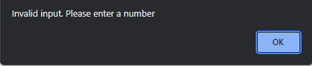
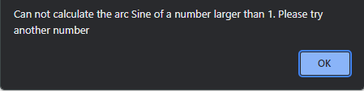

# Function Calculator

Function Calculator is an app that allows people to do simple calculations with functions. It is targeted towards students who need/want to have easy access to an easy to use calculator for specific functions. Function Calculator is a simple, responsive and easy to use app that can perform calculations with the most common functions people use.

__Image created using__ [Am I responsive](https://ui.dev/amiresponsive?url=https%3A%2F%2Fbytes.dev)

## Features

### Logo

At the top of the page is the logo in the style of a function wich is a fun and interresting way of displaying a logo. It is also thematic to what the app is about, functions.

### Display bar

The app also has a display bar where it will display numbers inputed by the user and will also show the full calculation of the input. Once the user has clicked on a button on the numberpad, the number appears in the display bar. After that the user can click on a function they want it to compute and the calculation will be displayed. Once the user clicks on the numberpad again, only the number inputted will be shown to the user.

### Keypads

Underneath the display bar there are two keypads. One for inputing numbers, a decimal point, deleteing and clearing the display, and one for the functions. The User will input a number (only one decimal point is counted), and will then click on a function button to execute the calculation. Which will then be displayed on the display bar.

### function calculations

  
If the user enters an invalid input, or a number that is not possible to calculate with a function. An alert popps up, informing them that an invalid input has been given. This helps the user to know that that value can not be computed.

### Possible features
* More functions can be added in the future that could create more complex calculations.
* Minus button so that the user can calculate functions with negative numbers.

## Testing
The app has been tested on different web browsers such ass oprah, chrome, edge etc. The app is responsive and the buttons work as they should, performing the calculations correctly.

### Unfixed bugs
* ~~The user can put in several decimal points after each other~~
* ~~The user can use some functions that are impossible with certain numbers~~
* When writing a number there is no limit as to how many numbers the user can put in which leads to the numbers ending up off screen.

### Fixed bugs
* The user can only input one decimal point
* The user can only execute funtions if the number inputted is supported by that function

## Attributions
I wrote the code for this app.

## Deployment
* The deployment process was as follows using GitHub pages:
  * Navigate to the settings tab in Github Repository and click pages
  * Select branch and click main
  * Press save and the Site becomes live [Function Calculator link](https://bricboi.github.io/function-calculator/)